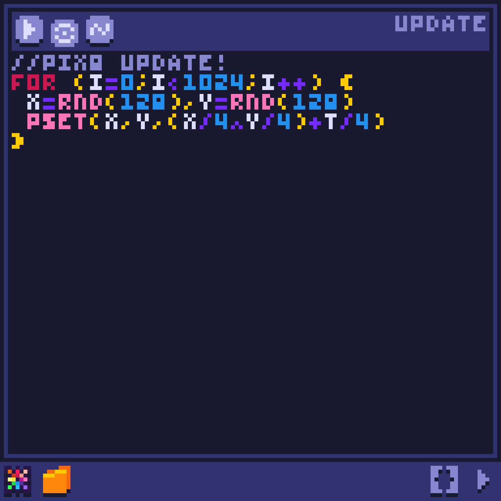

# Pixel-8
tiny Fantasy Console and JavaScript library for making tiny games or art

# Specifications for editor
| ‌  | ‌  |
| - | - |
| Display        | 128x128       |
| Cart           | 2048 char     |
| Sound          | ByteBeat      |
| Code           | JavaScript    |
| Sprite         | Not Supported |

# Api

## Editor
* there are 2 types of cartridges 
* by default the cartridge type is 2 but you can change it to first one by adding a "1" in the start of update tab
1. type 1 is a 32x32 plane that can be used to draw simple animations in 2D and 3D using the col for color output 

    >x & y are inputs for the square that is getting colored
    
    >sx & sy are the outputs for drawing
    
    >sz is output used for sorting rectangles based on z-index
2. type 2 gives you full control to the whole screen

## Console
* the console is a javascript environment that will return results and errors of command.

## Code tabs

* (init) tab code will just execute once when the cartridge starts running

* (update) tab code will execute every frame

* (wave) tab code is used to define the sound context output as a wave using t as input.
  > output wave has a sample rate that defines how many times the function should be excuted in 1 second that is defaultly 8000 
  
  > it can be changed by adding the sample rate number at start of code and split from the next function with ",".
  
  > the output of wave function is a number from 0 to 256

## js library options
> Resolution :
  > `<body res="n">` 
> disable canvas and styles :
  > `<body init="f">` 
> Adding sprite :
  > ``

## Colors
> RGB to color : `rgb2color(r,g,b)` 
> RGB to palette index : `rgb2index(palette,r,g,b)`

## Sprites/Images
> Draw a part of image : 
  > `spr(i,j,x,y,z)` 
  > `sspr(x,y,w,h,x1,y1,w1,h1,r)`

__x,y__ drawing position

__w,h,z__ drawing width,height,scale
 
__x1,y1/i,j__ sprite position
 
__w1,h1__ sprite width,height

## Drawing
> camera position : `camera(x,y)` 
> set color of a pixel : `pset(x,y,color)` 
> get color of a pixel : `pget(x,y)`

### filled shapes
  > RGB rectangle from palette : `pixs(x,y,r,g,b,s,w)`
  
  > `rectfill(x,y,w,h,c)` 
  > `rectrot(x,y,w,h,c,r)` 
  > `circfill(x,y,size,c)` 
  > `trifill(x,y,x1,y1,x2,y2,c)`

### shapes
  > `line(x,y,x1,y1,c,w)` 
  > `rect(x,y,w,h)` 
  > `circ(x,y,s,c,w)`

### clear screen
  > `cls(color)`

## Math
> Functions : 
  > pow, sqrt, cbrt, sin, asin, cos, acos, tan, atan, atan2, rnd(range), flr, deg(Radians to degrees)

> Rotate a point around pivot : 
  > `rot(x,y,r,cx,cy)` 
  > `rot2(x,y,z,a,b,cx,cy,cz)`

> Scale : 
  > `scl(x,s,cx)`
  > `scl2(x,y,s,cx,cy)`

> Distance between 2 points : 
  > `dist3D(v1,v2)` 
  > `dist2D(v1,v2)`

> Rotation between 2 points : 
  > `lookAt3D(v1,v2)` 
  > `lookAt2D(v1,v2)`

> Bayer Matrix Arrays : 
  > `pixel8.bayer4[x%4][y%4]` 
  > `pixel8.bayer8[x%8][y%8]`

> File : 
  > `getFile(url)` 
  > `copyText(txt)` 
  > `saveText(txt,name)` 
  > `saveImage(img,name)`

### stat(x)
1. pixel8
2. canvas
3. palette
4. cameraX
5. cameraY
6. mouseX
7. mouseY
8. mouseStart